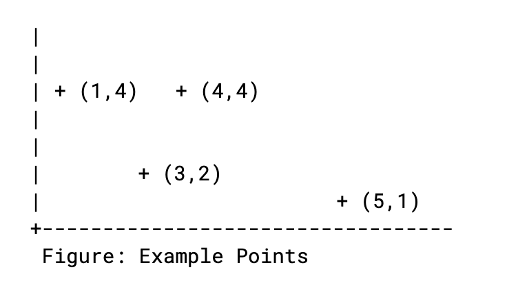

## coding challenge

Design an application that, given a set of coordinates [(x1, y1), ....... (xn, yn)], determine:

- the two closest points between each other
- the two most distant points between each other

Use your knowledge of *Clean and Maintainable Code* to create an *application with automated tests*.

Start with tests or implementation, whatever is better for you
